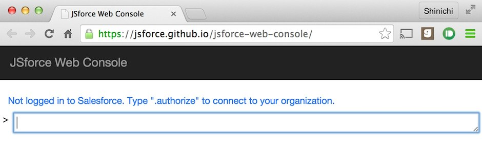
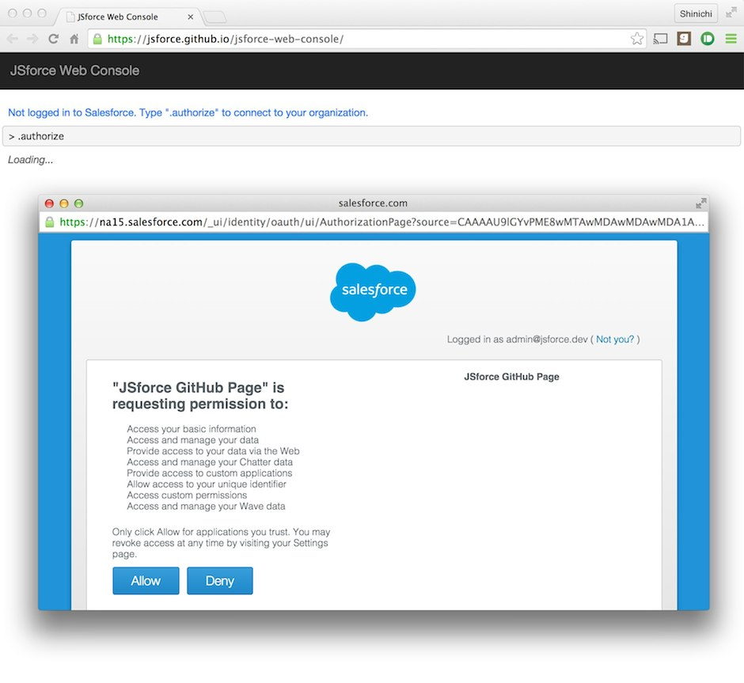
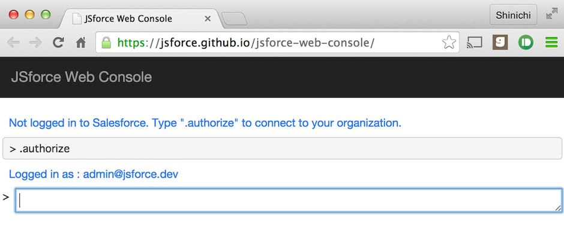
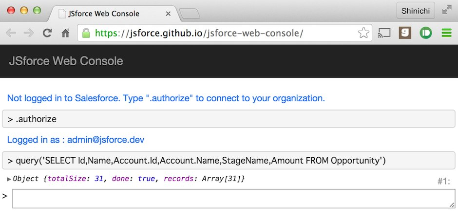
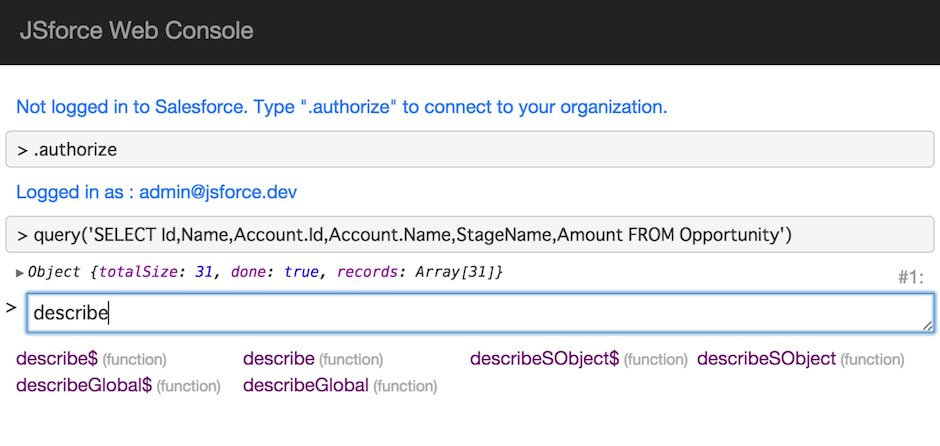
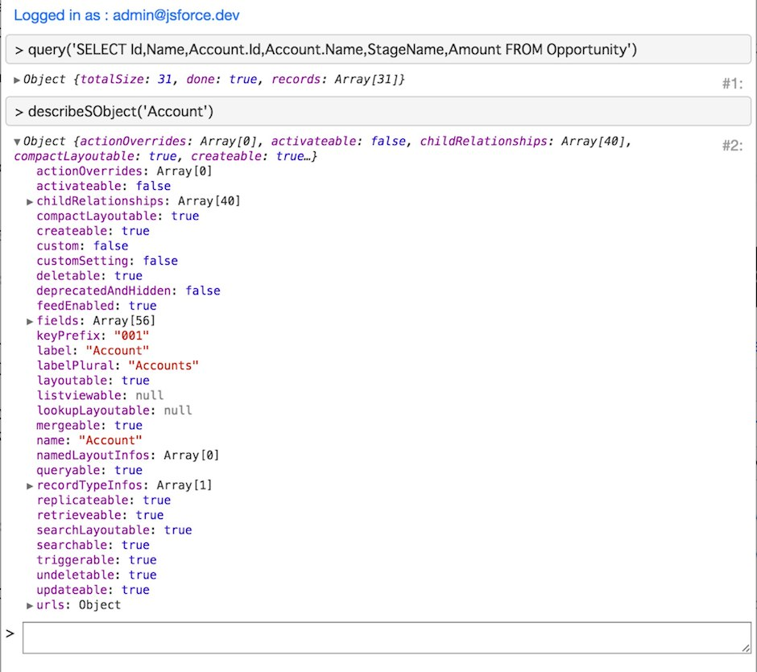
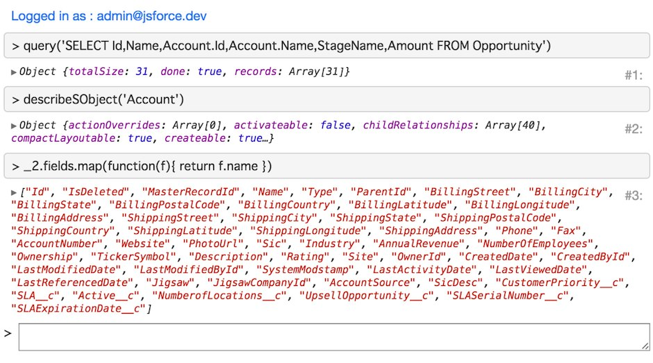
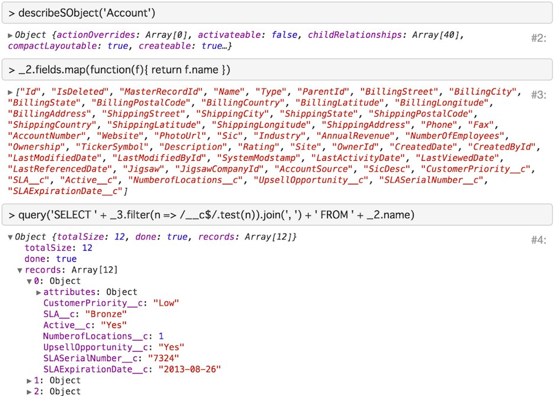

JSforce is useful not only for developing Salesforce application but also for learning Salesforce API itself.
JSforce has a "REPL mode" - you can issue an API request and confirm the result interactively from your terminal console.
The result can be manipulated in JavaScript, so you can even run a simple script in the REPL.

You know there is a well-known web application to check Salesforce APIs casually - [Workbench](https://workbench.developerforce.com/).
This web app does provide interfaces for many APIs of Salesforce, but just for checking the response.
It is not connected to the execution of scripts.

As the Workbench is provided in a web application service, many developer users can use the service who does not want to install softwares on their local personal computers.
On the other hand, JSforce required install of Node.js and NPM package, so it might have been an obstacle for the adoption of JSforce.

Today I would like to introduce the [JSforce Web Console](https://jsforce.github.io/jsforce-web-console/) - which is aimed to be an online version of JSforce REPL.
Through this service you can experience JSforce features immediately without installing Node.js or JSforce locally.

## Access

First, when you access to [JSforce Web Console](https://jsforce.github.io/jsforce-web-console/), you will be prompted by following screen.



You are alerted you may not have logged in to Salesforce. So type `.authorize` as prompted to connect to Salesforce.

Then a window popups to start the OAuth2 authorization flow. In login screen input the account of Salesforce you want to connect to.



Click "Allow" button to login, then the connection has been completed. You will see the message - "Logged in as: <username@organization>".



## Usage

As you confirmed the connection to Salesforce, let's execute a SOQL.

In JSforce, you usually create a connection to Salesforce API by instantiating a `jsforce.Connection` instance, but in Web Console there is a default instance which already connected to Salesforce.
Additionally, methods of the default instance are exposed in a global function.

Therefore running `Connection#query()` method for SOQL is done by inputting following text to the command prompt text box and pressing return key:

```
query('SELECT Id,Name,Account.Id,Account.Name,StageName,Amount FROM Opportunity')
```

You will see the result of SOQL like following:



The object value of the returned result will be shown in a tree form like Chrome DevTools.
By clicking the node of the tree you can expand/collapse the node value.

Next, let's type a text string of `descr` in the command prompt, and press tab-key.
Now you can see the content of text box to be completed to `describe` and candidates are shown in the list below. (Please check API reference for each of methods in candidates)



Type `describeSObject('Account')` and press return key. The result of the call can be checked in tree form as same as the SOQL query result.



These executed results can be reused afterward in the console. In order to access the result, you need to check the number located in the right side of the tree output.
For example, if there is a number of '#2' is shown there, you can access to the value via variable named `_2`.

Following example shows how to access the previous `describeSObject('Account')` result and extract the API names of the fields.



The result of the previous command will be stored in the variable named `_` (This is very same as JSforce Node.js REPL).

Combine the above execution results, here is an example to execute a query to fetch all custom fields in Account object.



You may noticed that the above example uses a feature of ECMAScript 6 - arrow function.
As [babel](https://babeljs.io/) is embedded in the JSforce Web Console, you don't have to worry about the browser support for writing the latest JavaScript notation (Of course the normal JavaScript is also fine, though).

## List of Commands

In JSforce Web Console there are several commands to work on the REPL. The first `.authorize` command to connect to Salesforce is the one of them.
The list of commands are shown below:

- **.authorize**      Start OAuth2 authorization flow to connect to Salesforce
- **.clear**          Clear all logs shown in the display
- **.help**           Show help to list the commands
- **.disconnect**     Discard the current connection and remove connection information from the registry.
- **.open**           Open Salesforce web page by logged in user.


## Embedded Function

Addition to JSforce APIs, there are embedded functions for the web console.
Here lists examples of embedded functions.

- **clear()**         Clear all logs shown in the display
- **copy(value)**     Copy value of the argument "value" to the clipboard (Same as the `copy()` function in Chrome Dev Tools)
- **console.log(message)** Output execution log to the display. This will output the value to standard console of the browser, but also to REPL output.


## Summary

The JSforce Web Console enables things which you could try only in JSforce REPL in Node.js even in Web UI.

The Workbench only allows you to confirm the API request/response, and you should write application code in the editor to test the behavior. However, JSforce Web Console allows you to do try-and-error sequences in online environment to some degree.

Compared to Salesforce's Developer Console where only Apex code can be executed, JSforce is in JavaScript which is more flexible for usual developers. Of course you can execute Apex in JSforce by using Tooling API, though.
