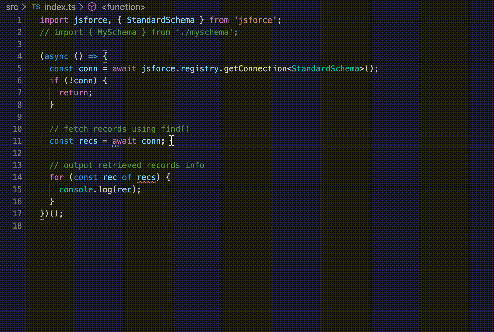

We've recently published the first alpha version of JSforce 2.0. You can simply access to the latest alpha by following command.

```
$ npm i -g jsforce@alpha
```

[As already announced](https://github.com/jsforce/jsforce/issues/889), this version has been re-written in TypeScript, which is now becoming the most popular programming language not only for frontend web application developers but for server-side application developers using Node.js.

Of course it has non-official type definitions for JSforce lib in [DefinitelyTyped](https://github.com/DefinitelyTyped/DefinitelyTyped/tree/master/types/jsforce), the natively bundled type definitions are more consistent and sophisticated. 

The most important and fascinating feature in 2.0 is **Schema Type** support - which is all for developers who code applications in TypeScript language.
With the feature you can write code safely by checking object/field value types, and easily by completing them in the IDE like Visual Studio Code.

Please check the following GIF to see how the completion works.



## How to use Schema Type in your code

Here is an example code to use the schema type feature in TypeScript.

```typescript
import jsforce, { Connection, StandardSchema } from 'jsforce';

async function main() {
  // Specify schema of connecting organization
  const conn = new Connection<StandardSchema>();
  await conn.login(process.env.SF_USERNAME, process.env.SF_PASSWORD);

  // fetch records using find()
  const recs = await conn.sobject('Opportunity').find({
    CloseDate: { $lte: jsforce.Date.YESTERDAY },
    IsClosed: true
  });

  // output retrieved records info
  for (const rec of recs) {
    console.log(rec.Name, rec.Amount, rec.LastActivityDate);
  }
}
main();
```

You may have noticed that it is passing `StandardSchema` type when creating `Connection` instance.
By passing a Schema Type in the type variable of the constructor, the connection can aware the organization's object/field schema and use it in its type checking and inference.
The `StandardSchema` is a built-in Schema Type which has only standard Salesforce objects and fields information in the type definition.
If you are using custom objects or fields in your app, you can generate custom Schema Type definition by using `jsforce-gen-schema` command.

```
$ jsforce-gen-schema --help
Usage: jsforce-gen-schema [options]

Options:
  -u, --username [username]      Salesforce username
  -p, --password [password]      Salesforce password (and security token, if available)
  -c, --connection [connection]  Connection name stored in connection registry
  -l, --loginUrl [loginUrl]      Salesforce login url
  -n, --schemaName [schemaName]  Name of schema type (default: "MySchema")
  -o, --outputFile <outputFile>  Generated schema file path (default: "./schema.d.ts")
  --sandbox                      Login to Salesforce sandbox
  --no-cache                     Do not generate cache file for described result in tmp directory
  --clearCache                   Clear all existing described cache files
  -V, --version                  output the version number
  -h, --help                     output usage information

$ jsforce-gen-schema -u username@example.org -p pass123 -n MySchema -o ./myschema.d.ts
Logged in as : username@example.org
describing global
describing AcceptedEventRelation
describing Account
describing AccountBrand
describing AccountBrandShare
describing AccountChangeEvent
describing AccountCleanInfo
...
Dumped to: ./myschema.d.ts
```

To use the generated schema type, you simply import the generated type definition file and pass the imported schema to connection constructor type variable.

```typescript
import jsforce, { Connection } from 'jsforce';
import { MySchema } from './myschema';
// ...

const conn = new Connection<MySchema>();
```

If you give a schema type in the connection, API calls like `SObject#find()` query or CRUD operations are to be statically checked according to the corresponding field definitions in the schema.
Although available fields are surely typed according to their field definitions in the Salesforce organization, fields which are not defined in the schema are currently typed to `any` - this behavior might be changed in the production release.

```typescript
const conn = new Connection<StandardSchema>();
// ...

const accs = await conn.sobject('Account').find({
  Type: ['Partner', 'Customer'],
  BillingCountry: 'JP'
});
for (const acc of accs) {
  console.log(acc.Id); // acc.Id: string
  console.log(acc.Name); // acc.Name: string
  console.log(acc.NumberOfEmployees); // acc.NumberOfEmployees: number | null
  console.log(acc.FieldNotDefined); // acc.FieldNotDefined: any
}

const opps = await conn.sobject('Opportunity').find(
  {
    Type: 'New Business'
  },
  // specify selecting fields in array
  [
    'Id',
    'Name',
    'Amount',
    // if you want to select fields in relationship, specify them in the object with relationship name in the key.
    { Account: ['Id', 'Name'] },
    // the wildcard will fetch all fields defined in the related object
    { Owner: '*' }
  ]
);
for (const opp of opps) {
  console.log(opp.Id); // opp.Id: string;
  console.log(opp.Name); // opp.Name: string;
  console.log(opp.Amount); // opp.Amount: number | null;
  console.log(opp.Account?.Id); // opp.Account?.Id: string | undefined;
  console.log(opp.Account?.Name); // opp.Account?.Name: string | undefined;
  console.log(opp.Owner.Username); // opp.Owner.Username: string;
  console.log(opp.Owner.IsActive); // opp.Owner.IsActive: boolean;
  console.log(opp.FieldNotDefined); // opp.FieldNotDefined: any;
}
```

If you don't specify any schema type, the result will remain the same as before the 2.0.
If no Schema Type, you have to check by yourself if the fields are available in the queried result, or give an explicit type annotation for the record.

```typescript
const conn = new Connection();
// ...

const accs = await conn.sobject('Account').find();
for (const acc of accs) {
  console.log(acc.Id); // acc.Id: string | undefined;
  console.log(acc.Name); // acc.Name: any;
  console.log(acc.NumberOfEmployees); // acc.NumberOfEmployees: any;
  console.log(acc.FieldNotDefined); // acc.FieldNotDefined: any;
}

type OppRecord = {
  Id: string;
  Name: string;
  Amount: number | null;
};
const opps = await conn.sobject('Opportunity').find<OppRecord>();
for (const opp of opps) {
  console.log(opp.Id); // opp.Id: string;
  console.log(opp.Name); // opp.Name: string;
  console.log(opp.Amount); // opp.Amount: number | null;
  console.log(opp.FieldNotDefined); // error: Property 'FieldNotDefined' does not exist on type 'OppRecord'.
}
```

## Conclusion

The Schema Type feature will let you write a code easily and safely with Salesforce organization schema.
It is robust as same as the Apex in the Salesforce, and much more comfortable owing to the type inferences in TypeScript.
If you are going to try it, please give us feedback.

